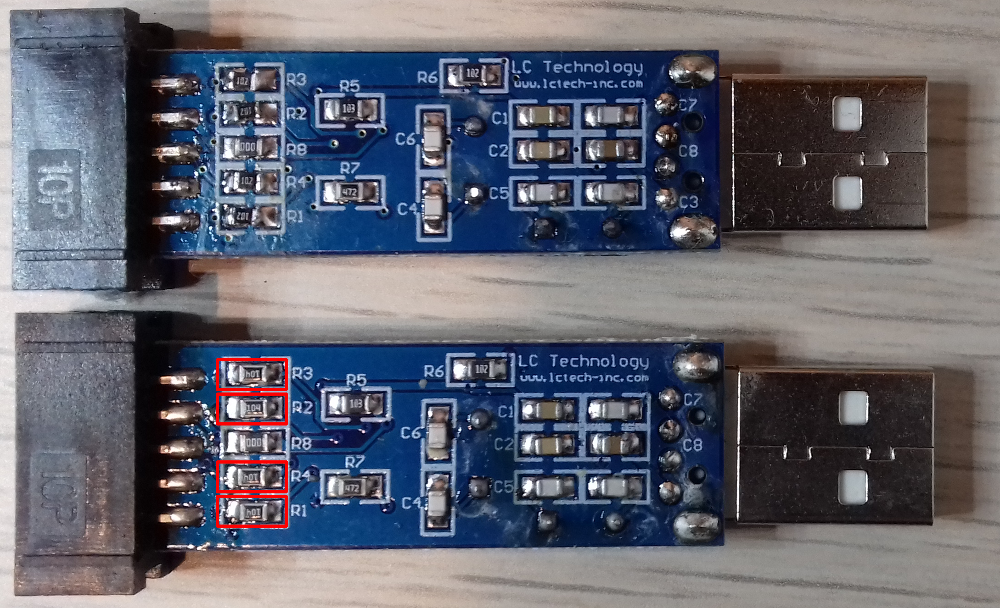

# JTAG ICE (from ebay)
## Initial problem and fix
Initially when trying to use the JTAG, nothing was working, avrdude and avarice were not able to communicate with the target ATmega16 properly.

When using avrdude, the device signature seemed to be kind of random.
<details> <summary>See output.</summary>

```
$ avrdude -c jtag1 -p m16 -U flash:w:main.hex

avrdude: AVR device initialized and ready to accept instructions

Reading | ################################################## | 100% 0.01s

avrdude: Device signature = 0x0000ff
avrdude: Expected signature for ATmega16 is 1E 94 03
         Double check chip, or use -F to override this check.

avrdude done.  Thank you.

$ avrdude -c jtag1 -p m16 -U flash:w:main.hex

avrdude: jtagmkI_initialize(): warning: OCDEN fuse not programmed, single-byte EEPROM updates not possible
avrdude: AVR device initialized and ready to accept instructions

Reading | ################################################## | 100% 0.01s

avrdude: Device signature = 0x00ffff
avrdude: Expected signature for ATmega16 is 1E 94 03
         Double check chip, or use -F to override this check.

avrdude done.  Thank you.

$ avrdude -c jtag1 -p m16 -U flash:w:main.hex

avrdude: AVR device initialized and ready to accept instructions

Reading | ################################################## | 100% 0.01s

avrdude: Device signature = 0x000000 (retrying)

Reading | ################################################## | 100% 0.01s

avrdude: Device signature = 0x0000ff
avrdude: Expected signature for ATmega16 is 1E 94 03
         Double check chip, or use -F to override this check.

avrdude done.  Thank you.
```
</details>

When using avarice, the system was still reporting unexpected values.
<details>
<summary>See output.</summary>

```
$ avarice -B 125000 -j /dev/ttyUSB0 -P atmega16 :6666
AVaRICE version 2.13, Jan 31 2020 07:23:52

JTAG config starting.
Hardware Version: 0xc0
Software Version: 0x7f
Reported JTAG device ID: 0x0
Configured for device ID: 0x9403 atmega16 -- FORCED with atmega16
JTAG config complete.
Preparing the target device for On Chip Debugging.

Enabling on-chip debugging:
Waiting for connection on port 6666.
```
</details>

The previous results gave the impression that there was something wrong with the connection, after inspecting the circuit board, the resistors that are in between the ATmega16 on the JTAG and the target ATmeta16 seemed to have a greater value than needed, this was confirmed by the following schematic [AVR-JTAG-Schematic-Diagram.pdf](https://www.openimpulse.com/blog/wp-content/uploads/wpsc/downloadables/AVR-JTAG-Schematic-Diagram.pdf).
After replacing the 100k resistors for 1k resistor (image below), avarice and avrdude started working straight away.


<details>
<summary>Correct output of avrdude.</summary>

```
$ avrdude -c jtag1 -p m16 -U flash:w:main.hex

avrdude: AVR device initialized and ready to accept instructions

Reading | ################################################## | 100% 0.01s

avrdude: Device signature = 0x1e9403 (probably m16)
avrdude: NOTE: "flash" memory has been specified, an erase cycle will be performed
         To disable this feature, specify the -D option.
avrdude: erasing chip
avrdude: reading input file "main.hex"
avrdude: input file main.hex auto detected as Intel Hex
avrdude: writing flash (136 bytes):

Writing | ################################################## | 100% 0.06s

avrdude: 136 bytes of flash written
avrdude: verifying flash memory against main.hex:
avrdude: load data flash data from input file main.hex:
avrdude: input file main.hex auto detected as Intel Hex
avrdude: input file main.hex contains 136 bytes
avrdude: reading on-chip flash data:

Reading | ################################################## | 100% 0.05s

avrdude: verifying ...
avrdude: 136 bytes of flash verified

avrdude: safemode: Fuses OK (E:FF, H:19, L:E1)

avrdude done.  Thank you.
```
</details>

<details>
<summary>Correct output of avarice.</summary>

```
$ avarice -B 125000 -j /dev/ttyUSB0 -P atmega16 :6666
AVaRICE version 2.13, Jan 31 2020 07:23:52

JTAG config starting.
Hardware Version: 0xc4
Software Version: 0x7f
Reported JTAG device ID: 0x9403
Configured for device ID: 0x9403 atmega16 -- Matched with atmega16
JTAG config complete.
Preparing the target device for On Chip Debugging.
Waiting for connection on port 6666.
```
</details>

## Programming the target
Using avrdude, as avarice dropped the support for programming the target. When connecting the JTAG, /dev/ttyUSB0 appeared, to tell avrdude to use this serial as default:
```bash
$ echo 'default_serial     = "/dev/ttyUSB0";' >> $HOME/.avrduderc
```

To upload main.hex to the ATmega16:
```bash
$ avrdude -c jtag1 -p m16 -U flash:w:main.hex
```

## Debugging
Execute avarice, which is going to connect to the JTAG and create a socket to which avr-gdb is going to connect later:
```bash
$ avarice -B 125000 -j /dev/ttyUSB0 -P atmega16 :6666
```

Execute avr-gdb and connect to avarice:
```bash
$ avr-gdb -ex "target remote :6666" -ex "file main.elf"
```

After executing the previous command you should see something like:
```
GNU gdb (GDB) 8.3.1
...
    Reading symbols from main.elf...
    Remote debugging using :6666
    0x00000000 in __vectors ()
    (gdb) break main.S:21
    Breakpoint 1 at 0x7c: file main.S, line 21.
    (gdb) c
    Continuing.

    Breakpoint 1, main () at main.S:21
    21              brne    0b
    (gdb) info reg r2
    r2             0x1                 1
    (gdb) c
    Continuing.

    Breakpoint 1, main () at main.S:21
    21              brne    0b
    (gdb) info reg r2
    r2             0x2                 2
```
